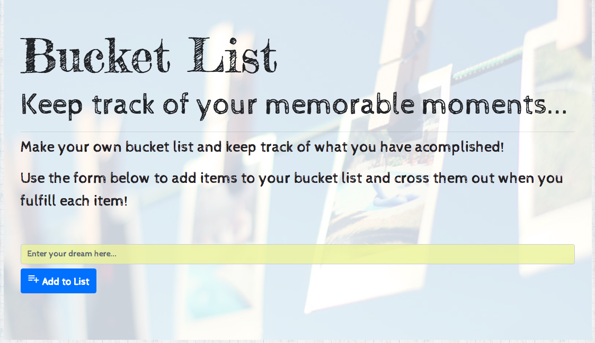
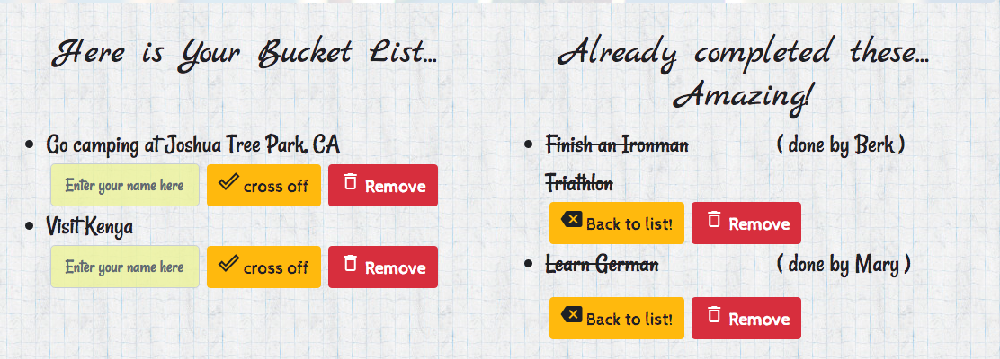

# bucketList
## Description:
This full stack app keeps track of things that a person wants to achieve or experience before reaching a certain age. The persistency of the list data is provided by a MYSQL database. The user can add new items to his/her list through the form group at the top of the page. Here, the user can enter any activity and upon clicking the "Add to List" button, the item is added to the Bucket List displayed in the right half of the page. Upon completion of any of the list items the user can click the "cross off" button and the item will be added to the list of accomplishments. Additional buttons to eliminate the items/accomplishments ("Remove" buttons) and to trnasfer accomplishments back to the Bucket List are also provided. Finally, the items in both lists are dynamic and user can modify the items easily by clicking on them and hitting return after the editing is completed. 



With all the functionallity given above the app 
1. **Creates enteries:** by add new items to the Bucket list via the form group at the top of the page through the ```/api/blist``` __post__ route.
2. **Reads the database:** by accessing the database everytime the page loads through the ```/``` __get__ route.
3. **Updates the database:** by corssing off the items from the bucket list or adding items back to the bucket list as well as changing the text of the list item through the ```/api/blsit/itemID``` __put__ route.
4. **Deletes the enteries:** by remove button that operates through the ```/api/blsit/itemID``` __delete__ route.

Hence, complete CRUD is carried out in the ORM that handles the database and database functionality.



## Technologies & Dependencies
### JavaScript:
Following NPM packages are used and required for the app to execute propoerly:
* Express
* Express-Handlebars
* MySQL
* bodyParser
* JQuery & Ajax

### Frontend Framework & Technologies:
* Bootsrap 4.0
* Google Fonts
* Google Material Icons

## How it works
The gif below shows how the app works.


