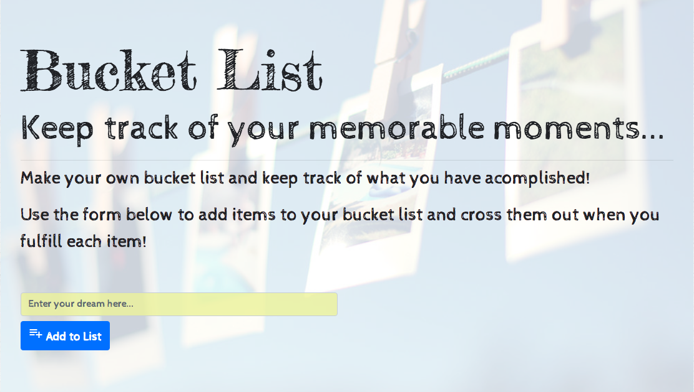

# bucketList
## Description:
This full stack app keeps track of things that users wants to achieve or experience before reaching a certain age. The persistency of the list data is provided by a MYSQL database. The user can add new items to the common list through the input form at the top of the page. Here, the user can enter any activity and upon clicking the "Add to List" button, the item is added to the Bucket List displayed in the left half of the page. Upon completion of any of the list items the user must enter his/her name to the form input box next to the control buttons and click the "cross off" button. Following this the item will be added to the list of accomplishments and will displaye the name of the user who completed it. Additional buttons to eliminate the items/accomplishments ("Remove" buttons) and to trnasfer accomplishments back to the Bucket List are also provided. Finally, the items in both lists are dynamic and user can modify the items easily by clicking on them and hitting return after the editing is completed. 

All the editing removal and user name input modifies the database. The database contains `user` and `bucketList` tables. The `user` table holds the user names and the `bucketList` table holds the activities composing the bucket list and their completion status. The `bucketList` table is also associated with the `user` table via the `foreign key` of `userId`. This allows to keep track of which user completed what activity. When an activity added to the completed activity list the user is added automatically to the `user` table in the database. Before doing this the `userName` is queried in the database and if the name already exists, no new entry is created but only the activity is associated with that users `userId`. The frontend javascript `public/js/list.js` assures that the user inputs a name when crossing off the item. If the name is left blank, the page displays an alert to inform the user to provide a name. Additional, input validation is carried out at database level, where `validate` function of sequelize is used to check if the `activity` is between 1 and 180 characters and the `userName` is between 1 and 140 characters. Additionally, the default value of the `crossed_off` status is set to false initially when an item added to the list. 



With all the functionallity given above the app 
1. **Creates activity enteries:** by add new items to the Bucket list via the form group at the top of the page through the ```/api/blist``` __post__ route.
1. **Creates user enteries:** by add new items to the user table via the form group next to each item  using ```/api/user``` __post__ route.
1. **Reads user enteries:** by getting/checking for existance of specific users in the user table when item is being crossed off. This ensures uniquenss of the enteries in the `users` table. This opperation is done via ```/api/user/:userName``` __get__ route.
2. **Reads the database:** by accessing the database everytime the page loads through the ```/``` __get__ route.
3. **Updates the database:** by corssing off the items from the bucket list or adding items back to the bucket list as well as changing the text of the list item through the ```/api/blsit/:itemID``` __put__ route.
4. **Deletes the enteries:** by remove button that operates through the ```/api/blsit/:itemID``` __delete__ route.

Hence, complete CRUD is carried out in the ORM that handles the database and database functionality.


## Technologies & Dependencies
### JavaScript:
Following NPM packages are used and required for the app to execute propoerly:
* Express
* Express-Handlebars
* MySQL
* bodyParser
* JQuery & Ajax
* sequelize

### Frontend Framework & Technologies:
* Bootsrap 4.0
* Google Fonts
* Google Material Icons

## How it works
The gif below shows how the app works.


